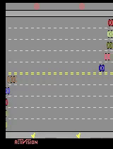
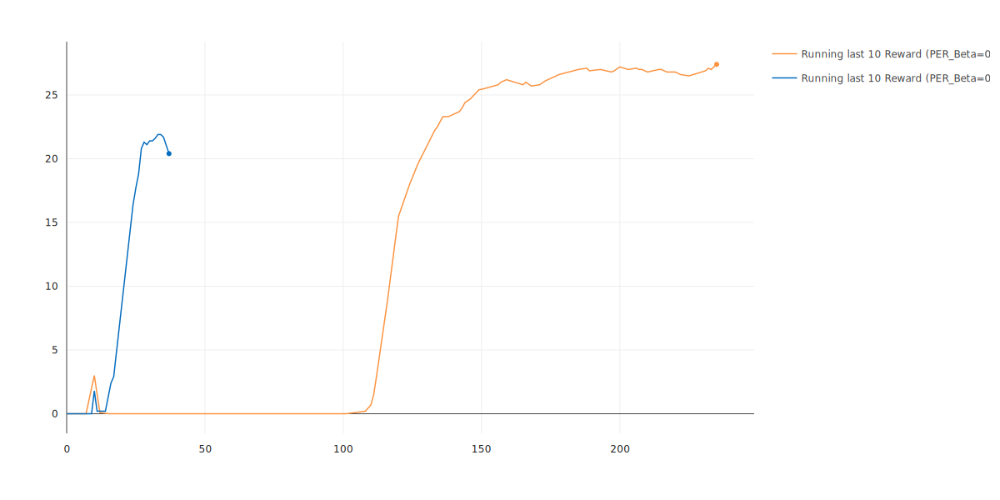
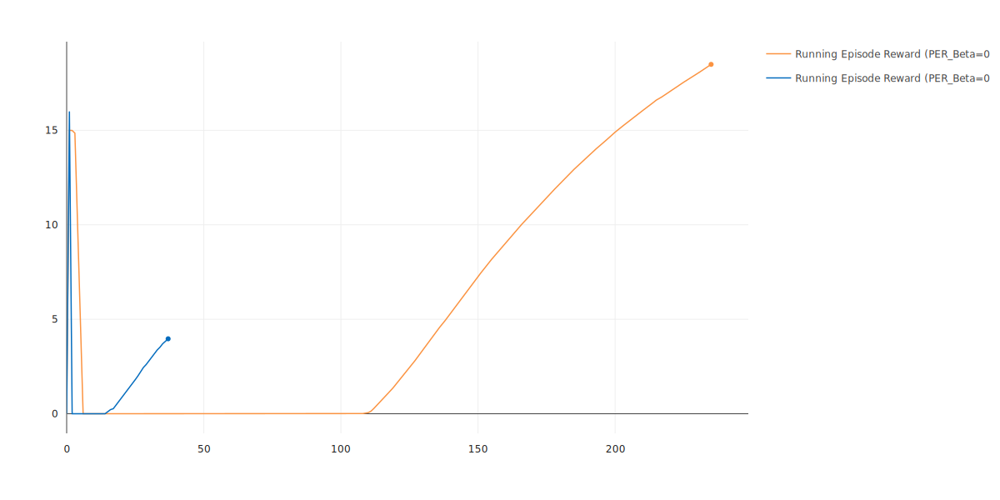
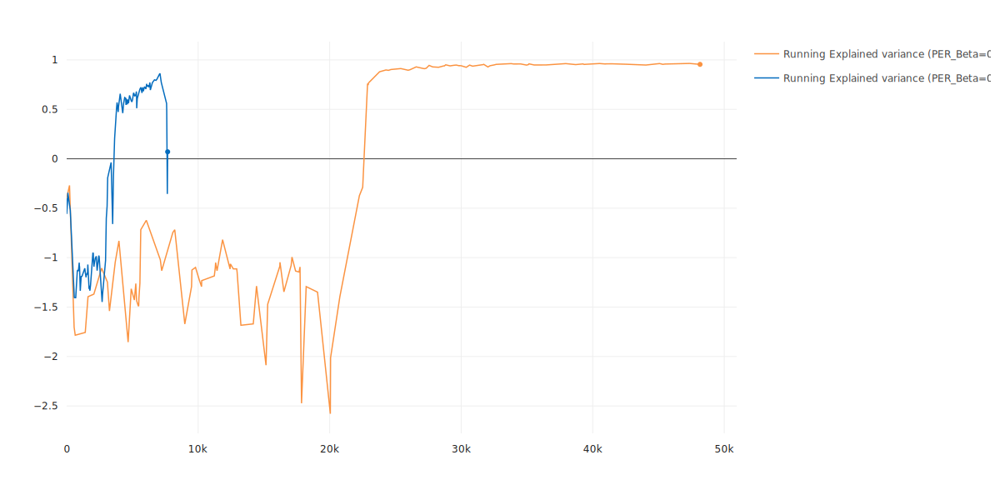
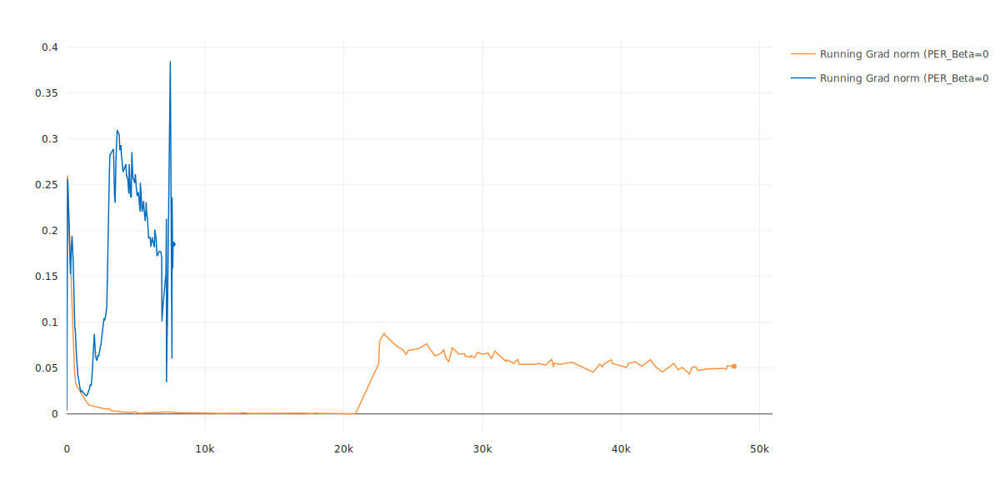
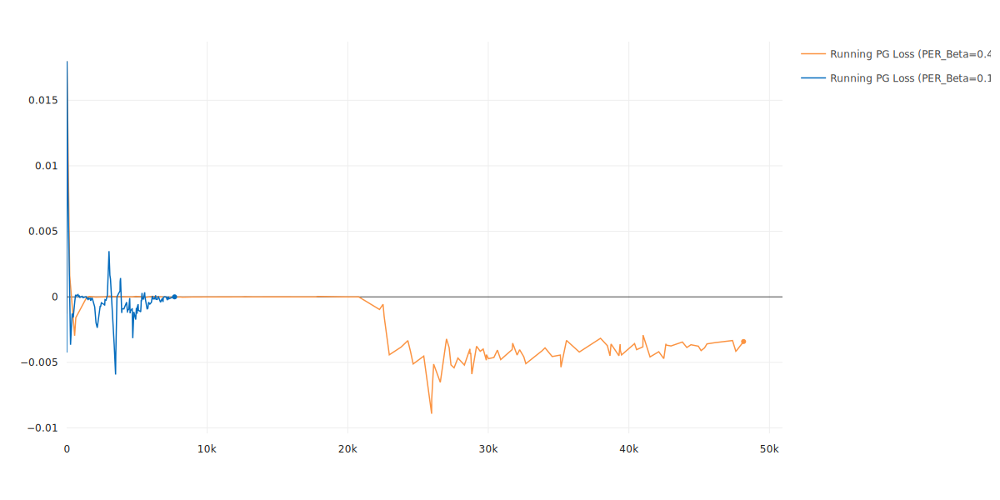
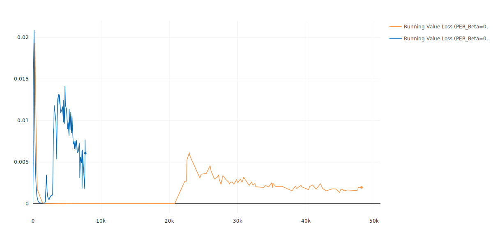

[](http://makeapullrequest.com)  

# A2C-SIL-TF2

This repository is a TensorFlow2 implementation of **Self-Imitation Learning (SIL)** with **Synchronous Advantage Actor-Critic (A2C)** as the backbone of action-selection policy.

In short, the SIL builds on the intuition that good past experiences should be exploited more and consequently driving to deep exploration. Thus, the SIL is responsible to improve the exploitation of good past decisions and is an auxiliary module that can be added to any action-selection policy.

The paper "Self-Imitation Learning" by Oh et al, combines the SIL with the synchronous version of the Advantage Actor-Critic method and showed that the SIL is applicable to any other Actor-Critic methods like Proximal Policy Optimization (PPO).

This repository follows the same procedure as the paper and produced results are obtained by combining the SIL with the A2C.

## Demo

<p align="center">
  
</p>  

## Results

<p align="center">
  
</p>  

> X-axis corresponds episode numbers
> Blue curve has 0.1 for the value of Bias Correction for Prioritized Experience Replay

The rest of the training plots are at [the end](#results-contd) of the current Readme file.

## Important Notes About This Code!

While the current code tries to put the ideas of the SIL into practice, there are some differences between it and the [original implementation](https://github.com/junhyukoh/self-imitation-learning):
-  The SIL paper claims that it stores past experiences in a Replay Buffer and uses only useful and good memories without any constraints or heuristics about domain-specific configurations.  
However, in the original implementation, transitions of an episode are added to the replay buffer **if their corresponding episode contains at least a single transition with positive reward**. To be specific, [this part](https://github.com/junhyukoh/self-imitation-learning/blob/13eb8a79e9585f92761e0a4670bd76c2e0a7bf05/baselines/common/self_imitation.py#L266) of the original code:
```python
def update_buffer(self, trajectory):
    positive_reward = False
    for (ob, a, r) in trajectory:
        if r > 0:
            positive_reward = True
            break
    if positive_reward:
        self.add_episode(trajectory)
```
This heuristic is only valid for the Atari domain with its current DeepMind proposed preprocessing and decreases the generality of the SIL.  

A simple example is enough to underline that the above code is **only an aid** for faster training of Atari games with a specific preprocessing on rewards and decreases the generality:
Suppose we hand engineer the rewards of an Atari game like Pong so that we subtract a -2 from every timestep reward. This intervention moves rewards' range from [-1, 1] to [-3, -1] without losing the expressiveness of expected optimal behavior that should be encoded within the rewards. But, the above heuristic fails on this new environment and **should be tuned again** (= loss of generality)!

**As a result, the current code avoids applying such domain knowledge about the positivity of rewards**. 

- To speed up the training, the current code benefits from using and LSTMCell and the lighter network architecture introduced in the A3C paper instead of the larger DQN network.
- The current code uses Adam as its optimizer and no major violation was seen during training time, thus the clippings of the Advantage function, Log Probabilities, and Critic Loss of the original code (shown below) that uses RMSprop, were not required:
``` python
clipped_nlogp = tf.stop_gradient(tf.minimum(nlogp, self.max_nlogp) - nlogp) + nlogp
            
adv = tf.stop_gradient(tf.clip_by_value(self.R - tf.squeeze(model_vf), 0.0, clip))

delta = tf.clip_by_value(v_estimate - v_target, -self.clip, 0) * mask
```
>Not required.

- The Learning Rate is different from the paper.
- **One caveat of the current code is that it can not be executed on [Colab](https://colab.research.google.com/)** since there is an unknown issue that the total amount of available RAM is consumed **despite lowering the replay buffer size** as much as possible, thus the whole training was done on [paperspace.com](https://www.paperspace.com/) **without any problem about the RAM or etc**.

## Table of Hyperparameters
>Hyperparameters used for Pong and Freeway environments.

Parameter| Value
:-----------------------:|:-----------------------:|
lr			     | 2.5e-4
alpha (Exponent for PER)| 0.6
Beta (Bias Correction for PER)| 0.4
entropy coefficient for A2C | 0.01
critic coefficient for A2C | 0.5
max grad norm	          | 0.5
num of sil updates| 4
sil batch size | 512
crtitc coefficient for SIL | 0.01
entropy coefficient for SIL | 0
num parallel workers| 8
rollout length | 80 &div; num parallel workers
memory size| 1e+5

## Dependencies

- comet_ml == 3.15.3
- gym == 0.17.3
- numpy == 1.19.2
- opencv_contrib_python == 4.4.0.44
- psutil == 5.5.1
- tensorflow == 2.6.0
- tensorflow_probability == 0.13.0
- tqdm == 4.50.0

## Usage

### How To Run
```bash
usage: main.py [-h] [--env_name ENV_NAME]
               [--total_iterations TOTAL_ITERATIONS] [--mem_size MEM_SIZE]
               [--interval INTERVAL] [--do_test] [--render]
               [--train_from_scratch]

Variable parameters based on the configuration of the machine or user's choice

optional arguments:
  -h, --help            show this help message and exit
  --env_name ENV_NAME   Name of the environment.
  --total_iterations TOTAL_ITERATIONS The total number of iterations.
  --mem_size MEM_SIZE   The SIL's memory size.
  --interval INTERVAL   The interval specifies how often different parameters should be saved and printed, counted by iterations.
  --do_test             The flag determines whether to train the agent or play with it.
  --render              The flag determines whether to render each agent or not.
  --train_from_scratch  The flag determines whether to train from scratch or continue previous tries.
```
- **In order to train the agent with default arguments, execute the following command**:
```shell
python3 main.py --train_from_scratch
```
- **If you want to keep training your previous run, execute the following (remove `--train_from_scratch` flag from the previous command):**
```shell
python3 main.py
```
### Pre-Trained Weights
- There are pre-trained weights of the agents that were shown in the [Results](#Results)  section playing, if you want to test them by yourself, please do the following:
1. Choose your desired environments' weights from _Results/Weights/env_name/*_
2. Create a folder named _Models_  in the root directory of the project and **make sure it is empty**.
3. Create another folder with an arbitrary name inside _Models_ folder. For example:  
```bash
mkdir Models/ Models/temp_folder
```
4. Put your `weights.h5` and `stats.json` files in your _temp_folder_.
5. Run the above commands and use `--do_test` flag:  
```shell
python3 main.py --do_test
```
## Tested Environments

- [x] PongNoFrameskip-v4
- [x] FreewayNoFrameskip-v4
- [ ] MontezumaRevengeNoFrameskip-v4

## Structure

```bash
.
├── Brain
│   ├── brain.py
│   ├── experience_replay.py
│   ├── __init__.py
│   ├── model.py
│   └── segment_tree.py
├── Common
│   ├── config.py
│   ├── __init__.py
│   ├── logger.py
│   ├── play.py
│   ├── runner.py
│   └── utils.py
├── LICENSE
├── main.py
├── README.md
├── requirements.txt
└── Results
    ├── Gifs
    │   └── Freeway
    │       └── Freeway.gif
    ├── Plots
    │   └── Freeway
    │       ├── Max_Episode_Reward.svg
    │       ├── Running_Entropy.svg
    │       ├── Running_Explained_Variance.svg
    │       ├── Running_Grad_Norm.svg
    │       ├── Running_last_10_Reward.svg
    │       ├── Running_PG_Loss.svg
    │       ├── Running_Total_Episode_Reward.svg
    │       └── Running_Value_Loss.svg
    └── Weights
        └── Freeway
            ├── stats.json
            └── weights.h5
```
1. _Agent_ package includes the neural network structure, the core of agent decision-making paradigm, and the agent's experience replay.
2. _Common_ includes minor codes that are common for most RL codes and do auxiliary tasks like logging, wrapping Atari environments and... .
3. _Results_ is the directory that Gifs,  plot images of the current Readme file, and pre-trained weights have been stored at.

## References

1. [_Self-Imitation Learning_, Oh, et al., 2018](https://arxiv.org/abs/1806.05635)
2.  [_Asynchronous Methods for Deep Reinforcement Learning_, Mnih et al., 2016](https://arxiv.org/abs/1602.01783)

## Acknowledgement

1. [ self-imitation-learning](https://github.com/junhyukoh/self-imitation-learning) by [@junhyukoh](https://github.com/junhyukoh)
2. [self-imitation-learning-pytorch](https://github.com/TianhongDai/self-imitation-learning-pytorch) by [@TianhongDai ](https://github.com/TianhongDai)
3. [a2c](https://github.com/openai/baselines/tree/master/baselines/a2c) by [@OpenAI ](https://github.com/openai)

## Results (Cont'd)

<p align="center">
  
</p>  

> X-axis corresponds episode numbers
> Blue curve has 0.1 for the  value of Bias Correction for Prioritized Experience Replay

<p align="center">
  
</p>  

> X-axis corresponds episode numbers
> Blue curve has 0.1 for  the value of Bias Correction for Prioritized Experience Replay

<p align="center">
  
</p>  

> X-axis corresponds iteration numbers
> Blue curve has 0.1 for the  value of Bias Correction for Prioritized Experience Replay

<p align="center">
  
</p>  

> X-axis corresponds iteration numbers
> Blue curve has 0.1 for the  value of Bias Correction for Prioritized Experience Replay

<p align="center">
  
</p>  

> X-axis corresponds iteration numbers
> Blue curve has 0.1 for the value of Bias Correction for Prioritized Experience Replay

<p align="center">
  
</p>  

> X-axis corresponds iteration numbers
> Blue curve has 0.1 for the value of Bias Correction for Prioritized Experience Replay

<p align="center">
  
</p>  

> X-axis corresponds iteration numbers
> Blue curve has 0.1 for the value of Bias Correction for Prioritized Experience Replay
