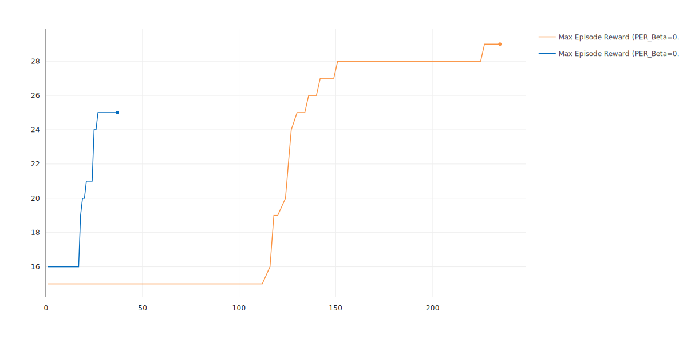
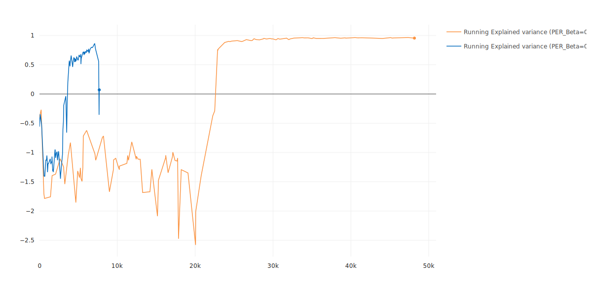
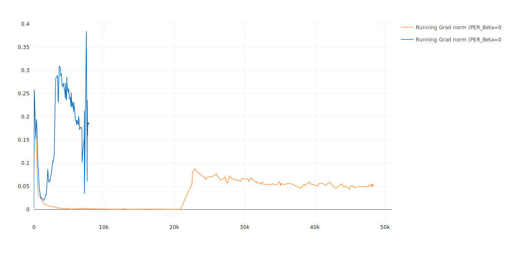
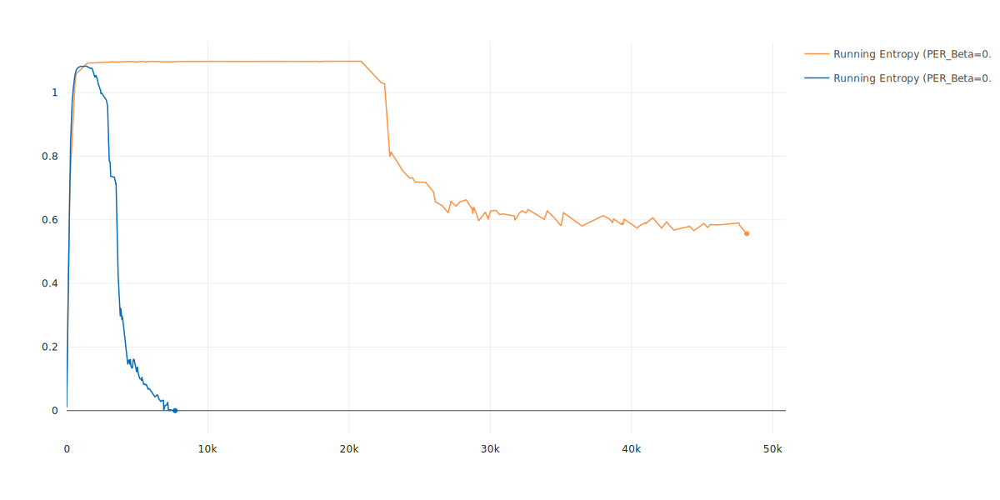
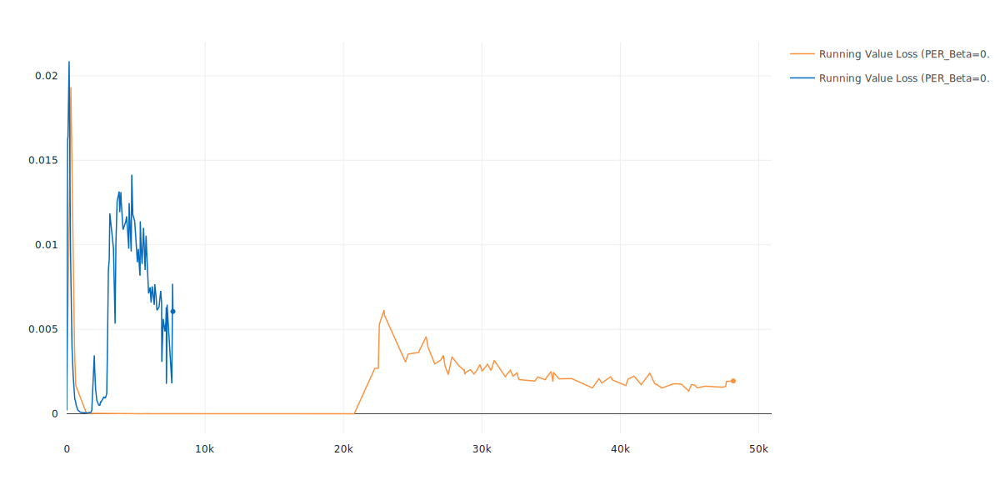

  

# A2C-SIL-TF2

This repository is a TensorFlow2 implementation of **Self-Imitation Learning (SIL)** with **Synchronous Advantage Actor-Critic (A2C)** as the backbone of action-selection policy.

In short, the SIL builds on the intuition that good past experiences should be exploited more and consequently driving to deep exploration. Thus, the SIL is responsible to improve exploitation of good past decisions and is an auxiliary module that can be added to any action-selection policy.

The paper "Self-Imitation Learning" by Oh et al, combines the SIL with the synchronous version of Advantage Actor-Critic method and showed that the SIL is applicable to any other Actor-Critic methods like Proximal Policy Optimization (PPO).

This repository follows the same procedure of the paper and produced results are obtained by combining the SIL with the A2C.

## Demo

  

  

## Results
> X-axis corresponds episode numbers
> Blue curve has 0.1 for  value of Bias Correction for Prioritized Experience Replay

  

  

Rest of the training plots are at [the end](#Results%20(Cont'd)) of the current Readme file.

## Results (Cont'd)

  

  

  

  

  

  

  

  

  

  

  

  

  

  
